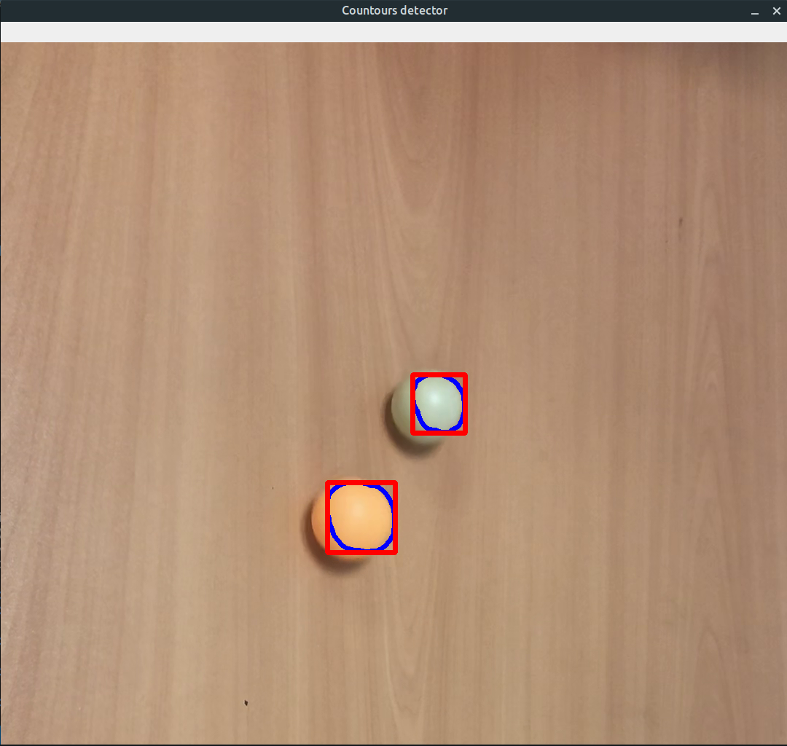

## Условие

Выделить контуры контрастного объекта на видео с помощью OpenCV, поместить скрипт в Docker-контейнер.

## Как запустить

```
$ sudo docker build -t opencv-detection .
$ sudo docker run --net=host --env="DISPLAY" --volume="$HOME/.Xauthority:/root/.Xauthority:rw" opencv-detection
```

## Пример выполнения
