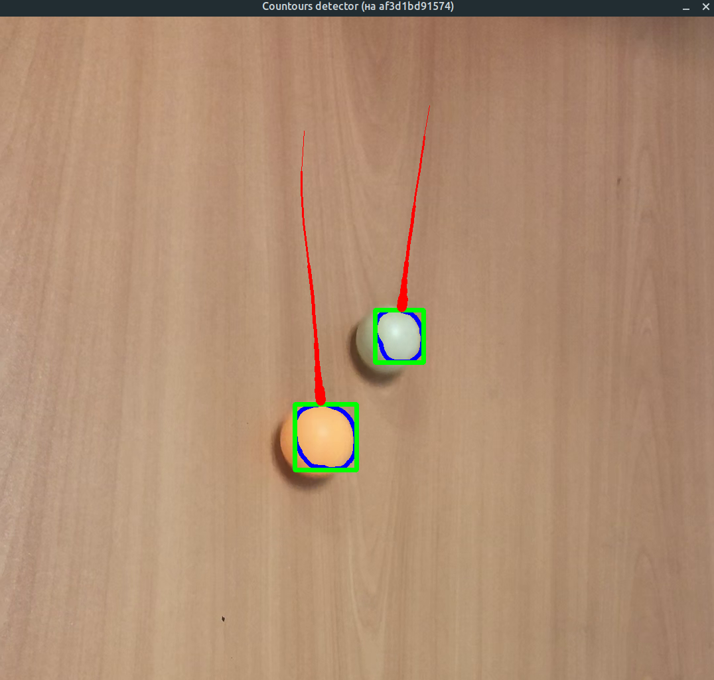
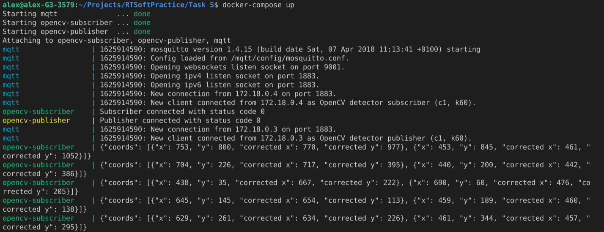

## Условие

1. Добавить фильтрацию положения объекта к алгоритму определения контрастного объекта
2. Добавить публикацию положения объекта по MQTT (сообщение в формате JSON)

## Как запустить

```
$ sudo xhost +local:root
$ docker-compose build
$ docker-compose up
```

## Пример выполнения

Траектория объектов:



Логи MQTT broker, subscriber и publisher:


