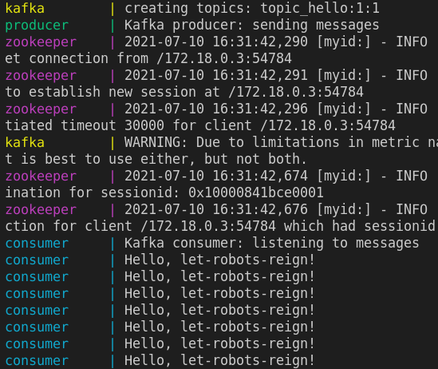

## Условие

Тест Apache Kafka, запущенный в Docker-контейнере. Каждые 10 секунд producer отправляет сообщение 'Hello, let-robots-reign!', а consumer его получает.

## Как запустить

```
$ docker-compose build
$ docker-compose up
```

## Пример выполнения

Логи контейнеров:


