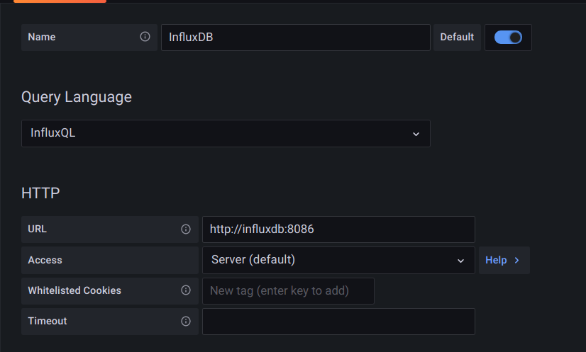
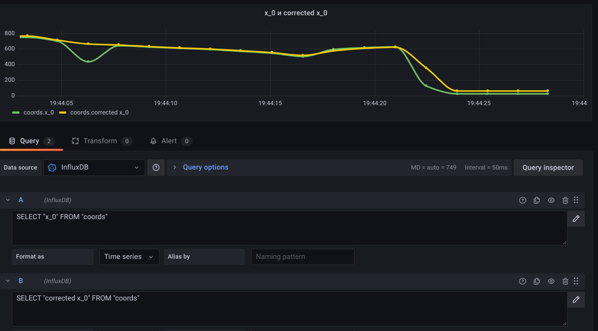
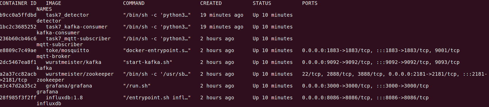
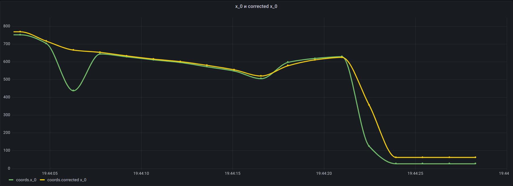
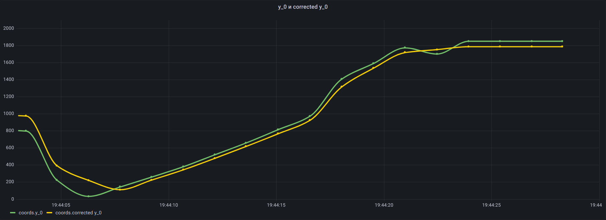
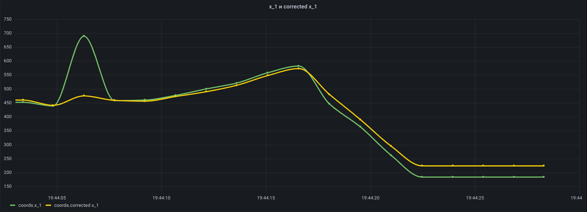
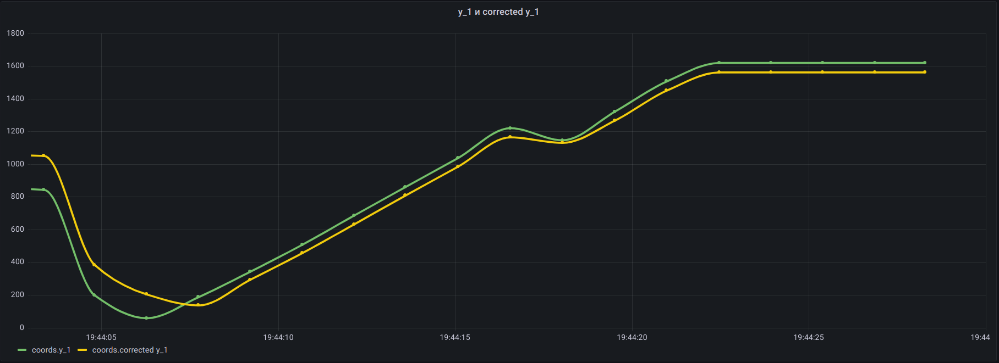

## Условие

Опубликовать информацию о траектории контрастных объектов по MQTT, поместить данные о траектории в kafka очереди (желательно), из kafka извлечь данные о траектории и поместить в influxdb. Добавить возможность визуализации данных при помощи graphana. Желательно поместить детектор, брокер, kafka, influx и графана в docker контейнеры и описать общую конфигурацию при помощи docker compose.

## Принцип взаимодействия

detector ⟶ mqtt-subscriber ⟶ kafka-consumer ⟶ influxdb ⟶ grafana

detector публикует координаты объектов, mqtt-subscriber получает координаты и кладет данные в Kafka, kafka-consumer кладет данные в influxdb, grafana отображает полученные данные

## Как запустить

```
$ sudo xhost +local:root
$ docker-compose build
$ docker-compose up
```
1. После запуска перейти по адресу localhost:3000, ввести в Grafana пару логин-пароль admin admin, назначить новый логин и пароль
2. Перейти в меню Configuration - Data sources и добавить InfluxDB согласно картинке:



3. Создать Dashboard и нужное количество панелей. На панели настроить отображение нужных данных с помощью запросов. Пример настройки для отображения координаты x_0:



## Запущенные контейнеры



## Графики

x и скорректированная координата x для первого объекта:



y и скорректированная координата y для первого объекта:



x и скорректированная координата x для второго объекта:



y и скорректированная координата y для второго объекта:


